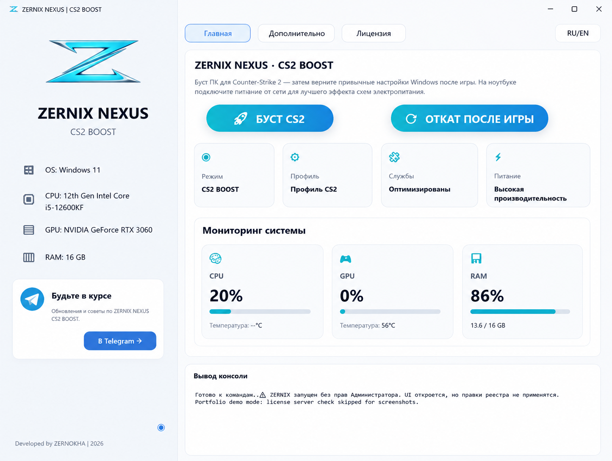
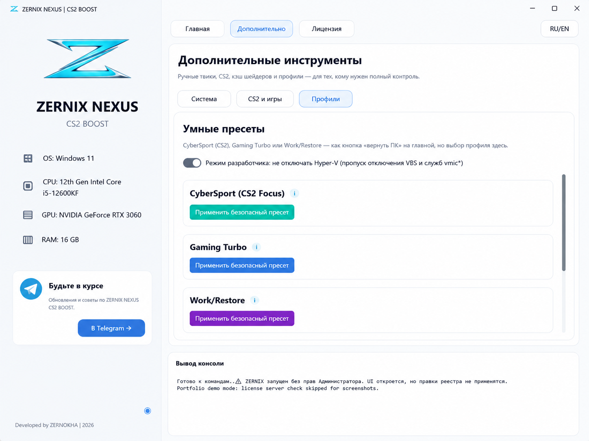
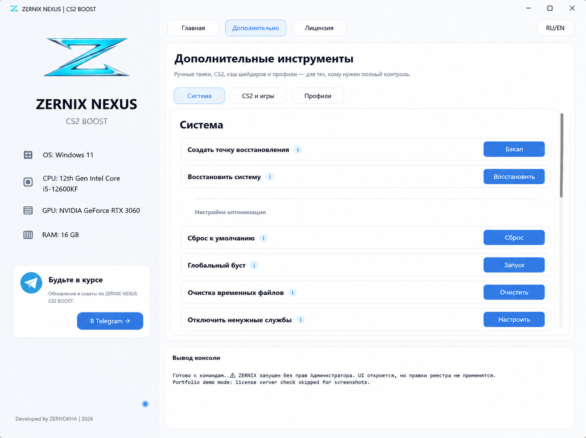
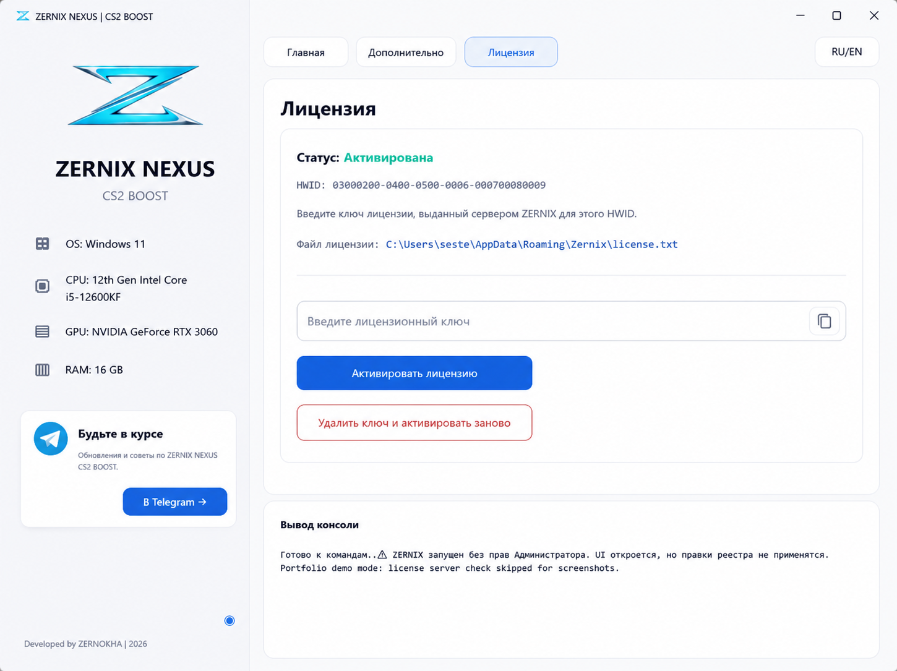

<p align="center">
  
</p>

# ZERNIX NEXUS

ZERNIX NEXUS — Windows desktop-инструмент для подготовки компьютера к игровой сессии в CS2, просмотра состояния системы, применения управляемых пресетов и последующего возврата к обычному рабочему профилю.

Репозиторий демонстрирует разработку desktop-интерфейса, интеграцию с Windows, обратимые системные операции, защитный UX, автоматизированные проверки и упаковку приложения в исполняемый файл.

> Приложение изменяет службы Windows, реестр, планы питания, сетевые настройки и конфигурацию игры. Перед использованием следует проверить каждое действие и создать точку восстановления. Системные функции стоит запускать только при понимании их эффекта.

## Интерфейс

| Главный экран | Пресеты |
| --- | --- |
|  |  |

| Расширенные инструменты | Состояние лицензии |
| --- | --- |
|  |  |

## Возможности

- Оркестрация **CS2 Session Boost** для повторяемой подготовки системы
- **Session Rollback** и пресет Work / Restore
- Профили CyberSport, Gaming Turbo и Work
- Ручные инструменты для служб Windows, питания, памяти, NTFS, визуальных эффектов, сети и очистки
- Работа с CS2-конфигурацией, telemetry, shader cache, launch options и сетевыми параметрами
- Мониторинг CPU, GPU и RAM на главном экране
- Интеграция с внешним license server и локальный demo-режим для портфолио
- Сценарии сборки через PyInstaller и защищённой упаковки Windows-версии

## Инженерный подход

- Экраны находятся в `ui/`, системные операции — в `core/`
- `AppAction` описывает команды независимо от UI-виджетов
- Переводы изолированы в `app/translations.py`
- Для рискованных действий предусмотрены предупреждения, подготовка restore point и документированные пути отката
- Audit matrix фиксирует права, необходимость перезагрузки и покрытие отката
- Чистая логика приложения и лицензирование покрыты unit-тестами

## Стек

- Python
- CustomTkinter
- psutil, WMI, pywin32
- Pillow
- requests и cryptography
- PyInstaller, Nuitka и PyArmor

## Структура репозитория

```text
app/                    Actions и переводы
core/                   Системные операции, очистка, security и latency-профили
ui/                     Widgets, стили, ресурсы и экраны приложения
tests/                  Unit-тесты неразрушающей логики
docs/AUDIT_MATRIX.md    Матрица действий, эффектов и отката
docs/QA_MANUAL_CHECKLIST.md
main.py                 Точка входа и координация экранов
licensing.py            Проверка лицензии и HWID
```

## Локальный запуск

```powershell
python -m venv .venv
.\.venv\Scripts\Activate.ps1
pip install -r requirements.txt
python main.py --demo
```

Demo-режим показывает полный интерфейс без обращения к license server. Для большинства системных операций всё равно требуются права администратора.

## Тесты

```powershell
python -m unittest discover -s tests
```

Автоматизированные тесты покрывают только безопасную логику приложения. Изменения Windows и сценарии отката требуют ручной проверки на тестовой системе с возможностью восстановления.

## Сборка

```powershell
.\build.bat
```

Защищённая сборка:

```powershell
.\build_protected.ps1 -StrictObfuscation
```

Реальные ключи, license-файлы, credentials сборки и готовые исполняемые файлы не должны попадать в репозиторий.

## Безопасность и ограничения

Покрытие отката документируется явно и не заявляется как полное. Глобальные TCP-настройки, process mitigations, параметры NVIDIA, fullscreen-настройки и созданная конфигурация CS2 могут потребовать ручной проверки после восстановления.

- [Матрица системных действий и отката](docs/AUDIT_MATRIX.md)
- [Чек-лист ручной проверки](docs/QA_MANUAL_CHECKLIST.md)

Это портфолио-проект по Windows desktop-разработке, а не обещание повышения производительности на любой конфигурации компьютера.
